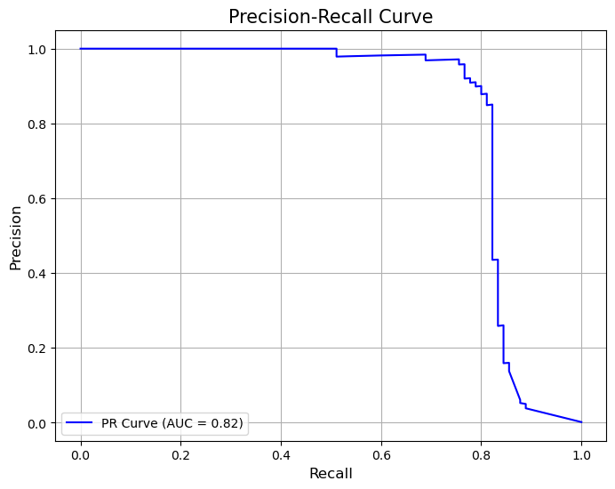

# Fraudulent transaction analysis
## 1. OVERVIEW
This project focuses on analyzing transactional data to identify fraudulent activities. The analysis was conducted as part of my data analytics portfolio to demonstrate my ability to work with real-world datasets, clean and process data, and derive actionable insights.

## 2. OBJECTIVES
- To explore, clean and preprocessing data.
- To identify patterns and anomalies in fraudulent transactions.
- To apply visualization technique for clear and impacful communicaiton.
- To develop actionable recommendations based on findings.
- To create a machine learning model for forecasting the future fraudulent.

## 3. KEY FEATURES
- **Data cleaning**: Handling missing values, duplicated values.
- **Exploratory data**: 
  * Basic statistic on numerical data.
  * Visualization of transaction trend and fraudulent pattern.
  * Check the balancing of dataset.
  * Plot all the numerical data to obtain the distribution.
- **Insights extraction**: Identifying the key indicator of fraudulent transactions.
- **Forecasting**: Using machine learning (Random Forest Classifier) to forecast the future fraudulent based on this dataset.

## 4. DATASET
- **Source**: Free source, giving by the Mastering Data Analysis academy.
- **Description**: The dataset contains transactions made using credit cards in September 2013 by European cardholders. The dataset includes transaction details such as Time (in seconds), Amount, Class (fraud labels), and other columns that were dimensionally reduced.
- **Size**: ~[284807 rows, 31 columns]

## 5. INSTALLATION
To run this project, ensure you have these following:
- Python 3.7 or later.
- Requirement libraries (listed in requirement.txt)

## 6. PROJECT STRUCTURE
fraudulent-transaction-analysis/
- data/         # Raw and cleaned dataset.
- notebooks/ # Jupyter notebook for EDA and analysis.
- README.md # Project description.
- requirements.txt # list of dependencies.
- report.pdf # final report

## 7. KEY INSIGHTS AND OUTPUT
* By using the code below, I plotted the amount patterns of day 1 and day 2, we observed some anomalies in transactions.
```
groupby_minute = df_copy.groupby('Minute')['Amount'].sum().reset_index()
groupby_hour = df_copy.groupby('Hour')['Amount'].sum().reset_index()

plt.figure(figsize=(20,10))

plt.subplot(2,2,1)
sns.lineplot(groupby_minute[groupby_minute['Minute'] <= 1440], x='Minute', y='Amount')
plt.title("Amount spending by minute at day 1")
plt.xlabel("Minutes")
plt.ylabel("Amount")

plt.subplot(2,2,2)
sns.lineplot(groupby_hour[groupby_hour['Hour'] <= 24], x='Hour', y='Amount')
plt.title("Amount spending by hour at day 1")
plt.xlabel("Hour")
plt.ylabel("Amount")

plt.subplot(2,2,3)
sns.lineplot(groupby_minute[groupby_minute['Minute'] > 1440], x='Minute', y='Amount')
plt.title("Amount spending by minute at day 2")
plt.xlabel("Minutes")
plt.ylabel("Amount")

plt.subplot(2,2,4)
sns.lineplot(groupby_hour[groupby_hour['Hour'] > 24], x='Hour', y='Amount')
plt.title("Amount spending by hour at day 2")
plt.xlabel("Hour")
plt.ylabel("Amount")

plt.show()
```
Here are the plots:

* From the plots of day 1 and day 2, I've observed the following insights:
  1. Normally, the number of transactions is very low in the early hours of the day (from 12:00 a.m. to 6:00 a.m.) and peaks between 10:00 a.m. and 5:00 p.m.
  2. At the minute level, there are some transactions with extremely high amounts during the early hours and late hours of the day. These transactions are suspected to be fraudulent because they deviate significantly from the usual pattern, with unusually high amounts.
* By using Random Forest machine learning with the hyperparameter below, I created a model which could forecast the future fraudulent transactions.

```
#Initilize the model and X, y
rf_optimized = RandomForestClassifier(n_estimators=150, oob_score=True, random_state=42, class_weight='balanced', max_depth=None, min_samples_leaf=1, min_samples_split=5)
X = df_copy.drop(columns=['Minute', 'Hour', 'Class'], axis = 1)
y = df_copy['Class']
X_train, X_test, y_train, y_test = train_test_split(X, y, test_size=0.2, random_state=42)

#Train the model
rf_optimized.fit(X_train, y_train)
```
Here are the metrics after testing model:

            precision    recall  f1-score   support

            0       1.00      1.00      1.00     56679
            1       0.72      0.97      0.83        67

      accuracy                           1.00     56746
      macro avg       0.86      0.98      0.91     56746
    weighted avg       1.00      1.00      1.00     56746

* Accuracy score:  0.9995241955380115
* P-R curve:

## 8. LIBRARIES
- Data analysis: Numpy and Pandas.
- Visualization: Seaborn, Matplotlib
- Machine learning: scikit-learn.
- Other: Jupyter notebook.

## 9. CONTACT INFORMATION
- **Name**: Tran Ngoc Bao
- **Email**: tnbao113@gmail.com
- **Linkedin**: [Tran Ngoc Bao](https://www.linkedin.com/in/tr%E1%BA%A7n-ng%E1%BB%8Dc-b%E1%BA%A3o-640796236/)
- **Github**: [TranNgocBao113](https://github.com/TranNgocBao113)

## 10. FUTURE IMPROVEMENT
- Using other machine learning method and compare with exsiting model to find the best model for future forecasting.
- Incorporate external datasets for more coprehensive insights.
